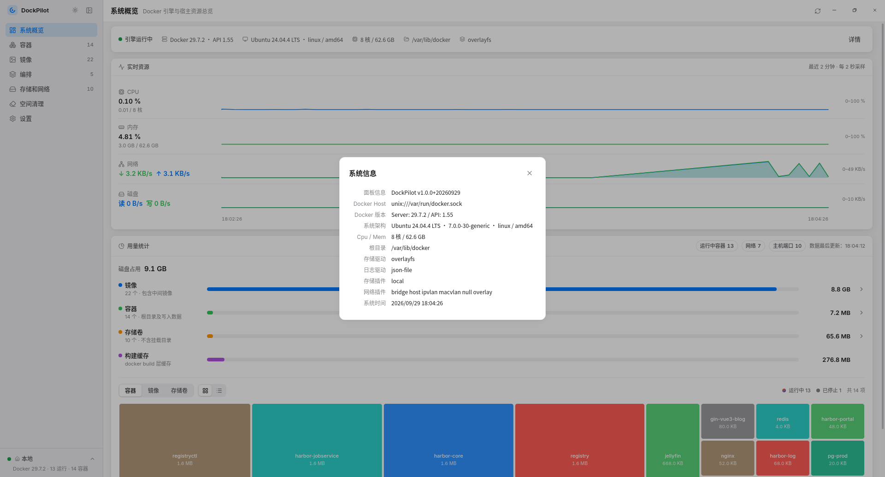
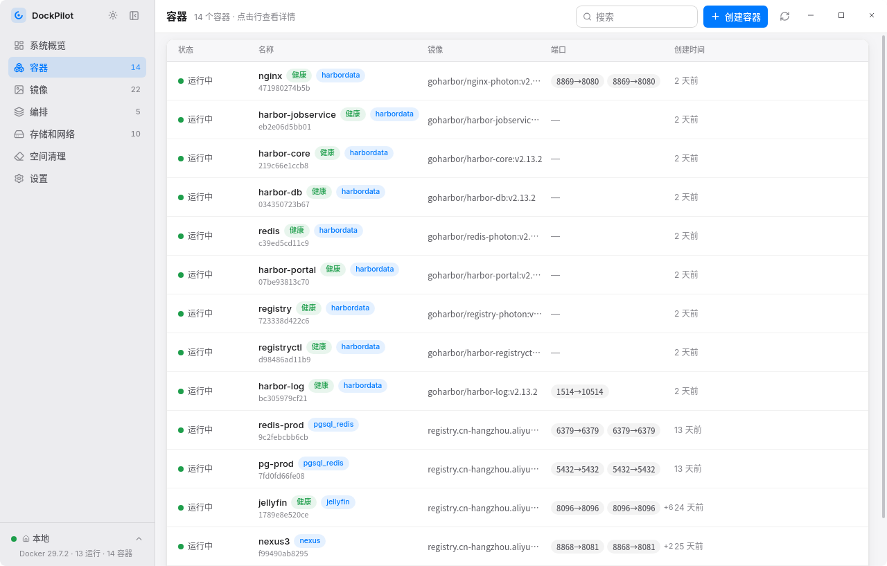
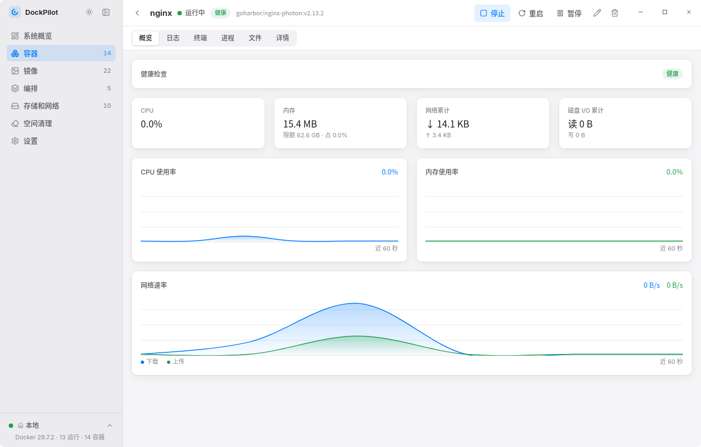
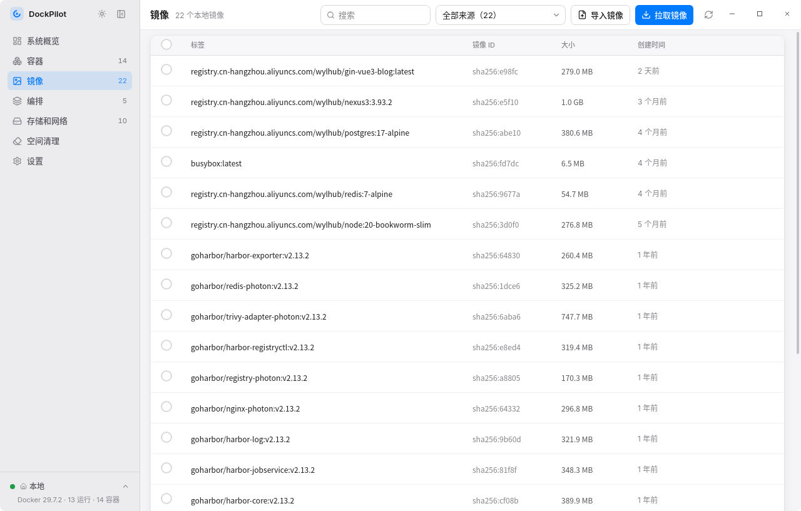
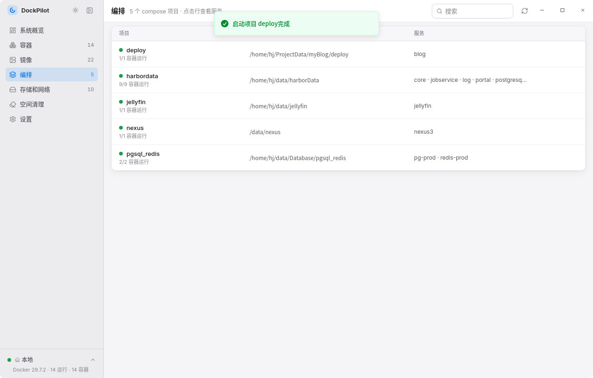
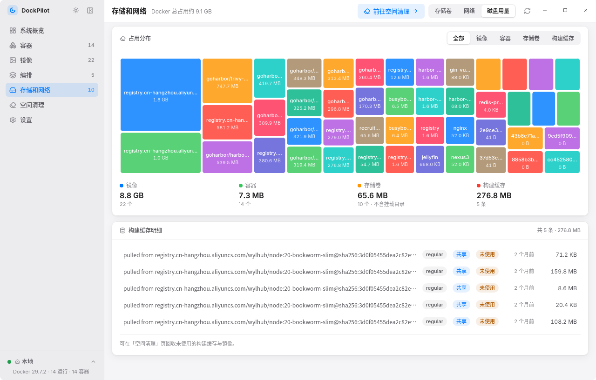
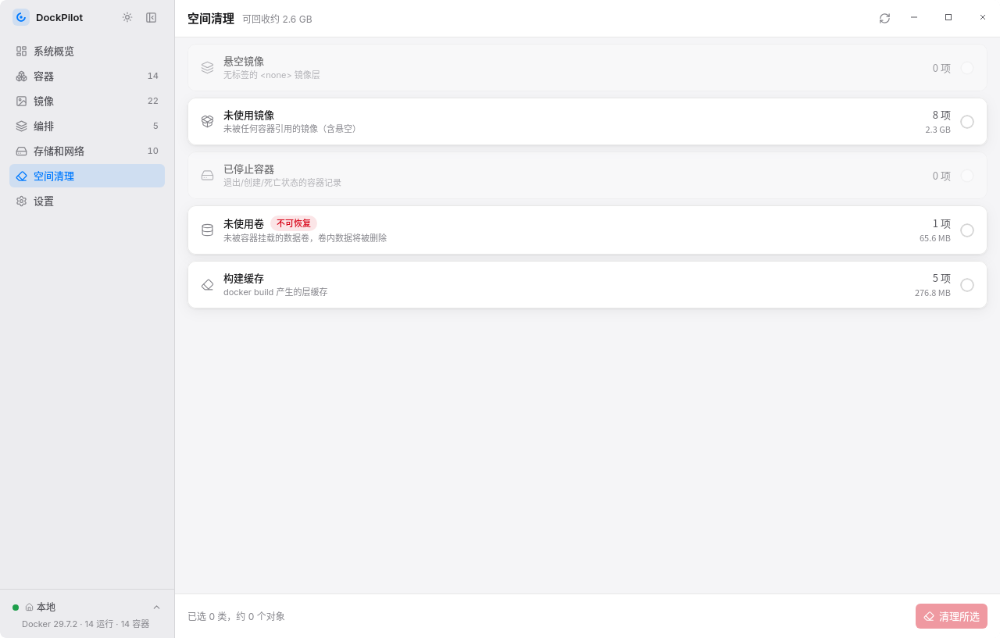
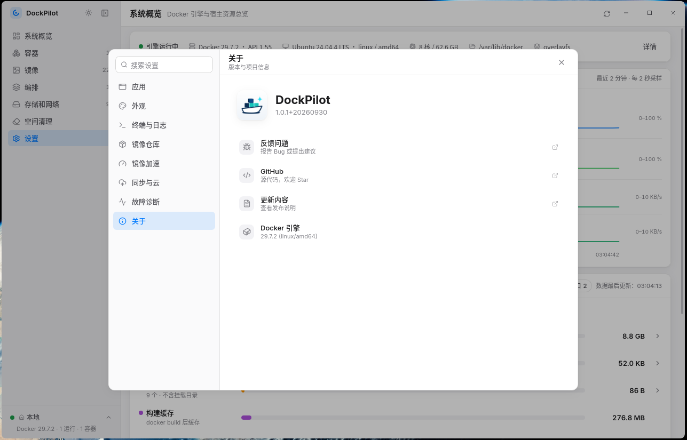

# DockPilot

**Docker 桌面管理器** — 容器 · 镜像 · 编排 · 存储网络 · 远程连接，一个安装包全带走

本地 Socket · SSH 隧道 · TLS · 明文 TCP · Linux · Windows

[](LICENSE)
[](https://github.com/WuYiLingOps/dockpilot/releases)
[](https://tauri.app)
[](https://rustup.rs)
[](https://react.dev)

**开源地址**：[GitHub](https://github.com/WuYiLingOps/dockpilot) · [Gitee](https://gitee.com/WuYiLingOps/dockpilot)

市面上的 Docker 管理工具（Portainer、Dockge 等）几乎都是 Web 端：要先部署一个容器服务，再用浏览器访问——管理 Docker 反而先给 Docker 添了个负担。

DockPilot 把这套能力装进桌面应用：Tauri 2 单窗口 + Rust 内核直连 Docker Engine API，管理本机或远程 Docker 无需部署任何服务。下载一个安装包就能用：不部署、不占端口、不登录。连接凭据与仓库密码都存在本机——SSH 只用私钥，仓库密码进系统钥匙串。

[项目预览](#项目预览) · [它能做什么](#它能做什么) · [怎么工作](#怎么工作) · [技术栈](#技术栈) · [快速开始](#快速开始) · [构建与安装](#构建与安装) · [远程连接](#远程连接) · [镜像推送](#镜像推送) · [常见问题](#常见问题与已知说明) · [项目结构](#项目结构)

---

## 项目预览

**系统概览**



**容器**



**容器详情**



**镜像**



**编排**



**存储和网络**



**空间清理**



**设置**



OrbStack 式布局：侧栏导航（顶部按钮可收起为图标栏，状态本地记忆）+ 点击进入详情，日志、终端、监控收敛为详情页内的 Tab；亮 / 暗双主题（跟随系统）与自定义一体化标题栏。窗口四角为 8px Fluent 圆角：Linux 走透明窗口 + CSS 裁剪，Windows 11 走系统原生 DWM 圆角（自带抗锯齿与阴影，Windows 10 无原生圆角 API 显示直角），最大化或全屏时自动恢复直角。

## 它能做什么

- **容器** — 列表 / 搜索 / 启动 / 停止 / 重启 / 暂停 / 恢复 / 删除，Docker 事件驱动实时刷新；healthcheck 徽标（健康 / 不健康 / 检查中）；compose 容器带项目徽标，点击直达编排详情
- **容器创建** — 镜像选择（本地不存在时自动拉取并显示进度）、容器名（可留空自动生成）、端口映射（多行、tcp/udp）、卷挂载（多行、只读）、环境变量、标签、资源限制（内存 MB/GB、CPU 核数可小数）、命令覆盖（按 shell 词法解析）、工作目录、网络选择、主机名、重启策略、自动移除 / 特权模式 / TTY / 标准输入，与 Docker Desktop 的 Run 能力对齐；支持粘贴 `docker run` 命令自动解析回填（-p/-v/-e/-l/--name/--restart/--memory/--cpus 等常用选项），以及克隆现有容器（inspect 反解析为表单，compose 标签自动剔除；原容器运行中时自动改为不重启策略并提示端口 / 卷可能冲突，避免克隆体因启动失败陷入无限重启循环）
- **容器详情** — 概览（CPU / 内存 / 网络 / 磁盘 I/O 实时曲线，healthcheck 状态与最近一次失败输出；未运行时展示退出码 / OOM 等退出原因与排查提示，启动即失败会在操作提示中直接告知）、日志（流式、自动跟随、关键字过滤、时间戳、stderr 高亮、按当前参数导出文件）、终端（交互式 bash / sh / ash，自适应窗口尺寸）、进程（docker top 实时进程表）、文件（浏览 / 上传 / 下载 / 删除，等同 docker cp；目录列表与删除需容器运行中）、原始 Inspect JSON 查看器（关键字过滤、一键复制）；支持在线更新配置（docker update 调整重启策略与内存 / CPU 限制，无需重建容器）
- **镜像** — 列表 / 搜索 / 来源筛选（按镜像地址前缀归组）/ 删除（可强制）/ 拉取（实时进度，缺省标签自动补 latest）；tar 归档导出（批量、共享层去重、可取消）与导入（多镜像）、标签管理与逐个移除；推送到私有仓库，支持多选批量推送（逐行自动推导目标引用、顺序推送、单镜像失败不阻塞，见「[镜像推送](#镜像推送)」）
- **编排（docker compose）** — 基于容器标准标签自动识别 compose 项目并聚合服务；项目级启动 / 停止 / 重启 / 暂停 / 下线（可选删卷删镜像）/ 构建 / 拉取，服务级启停与重启，输出流式展示可中途取消；compose 文件在线编辑（语法预检、自动备份、重新应用）。调用系统 compose CLI（自动探测插件版与独立版，未安装时仍可查看并提示）
- **存储和网络** — 存储卷（列表 / 详情含挂载点与使用容器 / 创建 / 删除，占用与引用计数来自 `docker system df`）、网络（详情含 IPAM 与已连接容器 / 创建 / 删除 / 连接断开容器，内置网络禁止删除）、磁盘用量（占比树图、构建缓存明细、直达空间清理），卷 / 网络数据事件驱动自动刷新
- **系统概览** — Docker 引擎与宿主资源总览：基础信息、容器 CPU / 内存占用、网络与磁盘实时曲线、用量统计树图；「存储卷 / 网络」统计卡片可点击直达对应子页签
- **空间清理** — 悬空镜像 / 未使用镜像 / 已停止容器 / 未使用卷 / 构建缓存的大小与数量统计，勾选一键清理并显示回收空间
- **多连接管理** — 多个 Docker 连接的配置、连通性测试（延迟与版本）、添加 / 编辑 / 删除、一键切换即时生效；侧栏底部快速切换。SSH 由应用自动建立加密隧道（私钥、rootless socket、跳板机），见「[远程连接](#远程连接)」
- **镜像仓库凭据** — 阿里云 ACR / Harbor 凭据管理与连通性测试，密码存入系统钥匙串，推送镜像用（见「[镜像推送](#镜像推送)」）
- **多设备云同步** — 连接配置、镜像仓库条目与显示设置端到端加密后同步到 GitHub 私有 Gist，多台设备自动合并；云端只存密文，同步密码不落任何存储，见「[云同步](#云同步)」
- **后台常驻** — 系统托盘常驻，首次关闭窗口弹窗询问「最小化到托盘 / 退出应用」（可勾选记住选择，设置 → 后台与关闭 可随时修改）；最小化后容器异常桌面通知持续生效，单实例运行、二次启动自动唤起已有窗口
- **设置** — 主题、连接管理、镜像仓库凭据、多设备云同步、列表刷新间隔、日志与终端默认值、容器异常桌面通知、关闭窗口行为（每次询问 / 最小化到托盘 / 完全退出），持久化到 `~/.config/com.dockpilot.app/settings.json`
- **镜像加速 / daemon.json 编辑（Linux）** — Docker Desktop 式直接编辑 `/etc/docker/daemon.json` 全文（pkexec 提权写入、覆盖前自动备份），实时校验（JSON 语法 + 语义检查 + dockerd `--validate` 深度校验，旧版 Docker 自动降级）、内置国内预设源快捷开关、一键测速、pkexec 不可用时回退为可复制的终端命令

### 它不是什么

__它不是__容器编排平台——面向单台 Docker daemon（本机或远程），不做 Swarm / Kubernetes 多集群编排；__也不是__镜像构建工具——没有 build 流水线；__更不是__常驻服务——完全退出后不在任何主机上留下后台进程，托盘最小化是用户主动选择的桌面后台运行，托盘菜单一键即可退出。

### 什么时候用它

| 现场 | 传统 Web 方案 | DockPilot |
| :--- | :--- | :--- |
| 管理本机 Docker | 部署 Portainer 容器，浏览器访问 | 安装包即装即用，直连本地 socket |
| 管理远程 Docker | 远程机开 2375 端口，或再部署一套服务 | SSH 隧道加密直连，远端零部署 |
| 离线 / 严苛内网 | 需要服务与浏览器互通 | 桌面应用本地运行，凭据不出本机 |
| 多台设备配置一致 | 配置存服务端，或手动导出导入 | 云同步到自己的 GitHub 私有 Gist，端到端加密自动合并 |

## 怎么工作

```
 React 19 界面 ◄── Tauri IPC / Channel ──► Rust + tokio 后端
                                               │
                         ┌─────────────────────┼─────────────────────┐
                         ▼                     ▼                     ▼
                     bollard              secret_store           daemon_config
                 （Docker Engine API）  （钥匙串 / 加密文件）    （daemon.json 提权）
                         │
        ┌────────────────┼────────────────┐
        ▼                ▼                ▼
    本地 socket       SSH 隧道        TLS / 明文 TCP
   （Linux 本机）  （远端零部署，      （2376 / 2375）
                    可经跳板机）
        └────────────────┼────────────────┘
                         ▼
              Docker Engine（本机 / 远程）
```

- **谁负责什么** — 前端只做展示与交互；到 Engine 的连接由 Rust 后端持有，所有 Docker 操作、流式进度、事件监听都跑在 Tokio 任务里
- **连接怎么建** — 设置里的每个连接是一份配置，切换即时重建并自动取消旧连接上的流；SSH 在本地拉起加密隧道（Linux socket 转发 / Windows TCP 转发），隧道随连接切换与应用退出回收，进程意外退出会在下次使用时自动重建
- **命令怎么执行** — Docker 操作走 bollard（Engine API）；compose 编排走系统 CLI（自动探测插件版与独立版）：本机 / 直连时注入 `DOCKER_HOST`，SSH 连接时经 SSH 直接在远程服务器上执行，本机无需安装 Docker
- **数据怎么刷新** — 列表由 Docker 事件推送自动失效刷新；日志、统计、终端等长驻流通过 Tauri Channel 推送并注册统一取消句柄——切页即停流，不留无主任务
- **敏感信息怎么存** — SSH 只存私钥路径（认证交给本机 ssh-agent）；仓库密码优先写入系统钥匙串，无钥匙串环境回退为机器绑定加密文件；推送时密码经请求头传给 daemon，不写 `~/.docker/config.json`、不落远端盘

## 技术栈

| 层 | 选型 | 说明 |
|---|---|---|
| 桌面框架 | Tauri 2 | 系统原生 WebView（Linux 使用 WebKitGTK，Windows 使用 WebView2），安装包与内存占用远小于 Electron |
| 后端 | Rust + bollard | Docker Engine API 的异步 Rust 客户端；Linux 本地 Unix socket，远程经 TCP / TLS / SSH 隧道 |
| 前端 | React 19 + TypeScript + Tailwind CSS 4 | 构建用 Vite |
| 终端 | @xterm/xterm | 与后端 exec 流通过 Tauri Channel 桥接 |
| 状态 | TanStack Query + Docker events | 列表数据由事件推送自动失效刷新 |

## 快速开始

**前置要求**：[Rust](https://rustup.rs) ≥ 1.77 与 Node.js ≥ 20（开发构建）。Linux 需 Ubuntu 22.04 / 24.04（其他发行版理论可用，未验证）；Windows 10 / 11 仅支持远程连接（SSH / TLS / 明文 TCP）。

```bash
git clone https://github.com/WuYiLingOps/dockpilot.git
cd dockpilot
npm install
npm run tauri dev
```

Linux 需要 WebKitGTK 构建依赖，且当前用户能访问 Docker socket（加入 docker 组后重新登录）：

```bash
sudo apt install libwebkit2gtk-4.1-dev build-essential curl wget file \
  libxdo-dev libssl-dev libayatana-appindicator3-dev librsvg2-dev

sudo usermod -aG docker $USER
```

**只想看界面**：`npm run dev` 打开浏览器预览（http://localhost:1420，主题切换按钮可试亮/暗两套）。`public/tauri-mock.js` 在非 Tauri 环境（无 `__TAURI_INTERNALS__`）下自动生效、为前端提供假数据，真实桌面应用中完全惰性——只改前端时可以不起 Rust。

**测试**：

```bash
cd src-tauri
cargo check          # 类型检查
cargo test           # 单测 + 集成测试（需要本机 Docker daemon 运行）
npm run build        # 前端 tsc + vite 构建
```

依赖本机 daemon 之外的远程链路回归测试默认忽略，运行方式见「[远程连接](#远程连接) → 远程连接集成测试」；Windows CI 仅运行不依赖本地 Docker daemon 的测试。

## 构建与安装

### 方式一：下载安装包（推荐）

从 [Releases](https://github.com/WuYiLingOps/dockpilot/releases) 下载对应平台的安装包：Linux 为 `.deb`，Windows 为 NSIS `.exe`（首次运行可能出现 SmartScreen 未知发布者提示，当前未配置代码签名）。

### 方式二：本地构建

Linux 使用 `management.sh` 打包 deb；Windows 使用 GitHub Actions 的 Windows runner 构建 NSIS 安装包。一键脚本支持版本同步、打包、安装和卸载：

```bash
./management.sh build        # 打包 deb（使用项目当前版本）
./management.sh build 0.3.4  # 同步版本号后打包 deb
./management.sh version 0.3.4 # 只同步版本号，不执行构建
./management.sh install      # 安装最新的 deb（脚本自动通过 sudo 提权）
./management.sh uninstall    # 卸载 dock-pilot
```

- `version <版本号>` 同步更新 `package.json`、`package-lock.json`、`Cargo.toml`、`Cargo.lock` 与 `tauri.conf.json`；`build <版本号>` 先执行同样的版本同步
- `build` 会自动清理旧 deb，并给版本号附加当日日期（如 `0.3.1+20260925`）便于追溯与覆盖安装；构建阶段通过 Cargo 命令行 `--config` 覆盖项目本地和用户全局配置，脚本内置阿里云、清华和中科大源（当前默认清华源，切换时按注释成对启用对应的 `replace-with` 和 `registry` 参数）
- 手动方式：`npm run tauri build`，产物在 `src-tauri/target/release/bundle/deb/`（deb 包名为 `dock-pilot`），例如 `sudo apt install ./DockPilot_0.3.1_amd64.deb`
- Windows NSIS 安装器内置快捷方式图标刷新钩子（`src-tauri/windows/installer-hooks.nsh`）：覆盖安装后自动重写已存在的桌面 / 开始菜单快捷方式并通知系统清空图标缓存，避免升级后快捷方式仍显示旧版本图标（Windows 会按 exe 路径缓存图标，且升级安装不会重建快捷方式）

**本地直接运行**（无需安装 deb）：

```bash
npm run tauri build
./src-tauri/target/release/dockpilot
# 调试构建：src-tauri/target/debug/dockpilot（cargo build 产物）
```

**Wayland 任务栏图标**：Wayland 下任务栏图标靠窗口 app-id 与 `.desktop` 文件匹配，dev 模式默认没有桌面入口，任务栏会显示通用图标。把调试二进制注册为用户级应用即可解决：

```bash
mkdir -p ~/.local/share/applications
cat > ~/.local/share/applications/dockpilot-dev.desktop <<'EOF'
[Desktop Entry]
Categories=Development;Utility;
Comment=DockPilot 开发模式（调试二进制）
Exec=/home/hj/ProjectData/docker-desktop/src-tauri/target/debug/dockpilot
StartupWMClass=dockpilot
Icon=/home/hj/ProjectData/docker-desktop/design/app-icon.png
Name=DockPilot (Dev)
Terminal=false
Type=Application
EOF
update-desktop-database ~/.local/share/applications
```

- `Exec` 与 `Icon` 需按实际仓库路径修改；应用窗口的 app-id 为二进制名 `dockpilot`
- **安装正式 deb 后请删除该文件**（`rm ~/.local/share/applications/dockpilot-dev.desktop`），避免与安装版（`StartupWMClass=dockpilot`）产生匹配歧义

## 远程连接

DockPilot 支持管理多个 Docker 连接并随时切换：Linux 支持 **本地 socket / SSH / TLS / 明文 TCP**，Windows 支持 **SSH / TLS / 明文 TCP**。连接在「设置 → Docker 连接」统一管理（添加 / 编辑 / 测试 / 删除），侧栏底部可快速切换当前连接；切换即时生效并自动刷新数据，无需重启应用。

### 使用方法

1. 进入「设置 → Docker 连接」→「添加连接」
2. 选择连接类型并填写地址，可先「测试连接」验证可达性（返回延迟与远程版本）
3. 保存后点击连接行，或用侧栏底部下拉切换
4. 切换后容器 / 镜像 / 存储等全部数据指向新连接；compose 编排操作也经同一连接执行（SSH 连接时直接在远程服务器上执行）

### SSH 连接（推荐）

无需在远程机开放任何 Docker TCP 端口，数据全程加密：

**前置条件**

- 本机已安装 ssh 客户端（Windows 请启用 OpenSSH Client）
- 远程机已运行 Docker daemon，并允许登录用户访问对应的 Docker socket
- 认证仅支持**密钥类方式**（显式私钥、ssh-agent、默认私钥 `~/.ssh/id_*` 或 `~/.ssh/config` 配置均可），不支持交互式密码

**配置免密登录**

Linux / macOS：

```bash
ssh-copy-id user@10.0.0.115                            # 输入一次密码，装本机公钥
ssh -o BatchMode=yes user@10.0.0.115 'docker version'  # 验证免密 + docker 权限
```

Windows（OpenSSH 不带 ssh-copy-id，无密钥先在 PowerShell 执行 `ssh-keygen -t ed25519`，一路回车）：

```powershell
type $env:USERPROFILE\.ssh\id_ed25519.pub | ssh user@10.0.0.115 "mkdir -p ~/.ssh && cat >> ~/.ssh/authorized_keys"
ssh -o BatchMode=yes user@10.0.0.115 "docker version"
```

Windows 如需使用 ssh-agent，先启用 OpenSSH Authentication Agent 服务（管理员 PowerShell：`Set-Service ssh-agent -StartupType Automatic; Start-Service ssh-agent`）。

**应用内配置**

| 字段 | 说明 |
|---|---|
| 地址 | `user@主机` 或 `user@主机:端口`（端口默认 22） |
| 私钥路径 | 可选；留空依次尝试默认私钥（`~/.ssh/id_*`）、ssh-agent 或 `~/.ssh/config` 配置 |
| 跳板机地址 | 可选；目标主机仅可经跳板机访问时填 `user@跳板机[:端口]`（经 ProxyJump 中转，跳板机认证同样走密钥类方式） |
| 远程 Socket 路径 | 可选；rootless Docker 填 `/run/user/<uid>/docker.sock`，默认 `/var/run/docker.sock` |

**实现方式**：Linux 上应用在本地建立 `ssh -N -L` 加密隧道，把远程 Docker socket 转发为本机 Unix socket；Windows 上使用 OpenSSH 将远程 Docker socket 转发到本机 TCP 端口。bollard 经对应端点通信；SSH 连接的 compose 编排操作则经 SSH 直接在远程服务器上执行。隧道随连接切换、应用退出自动回收，进程意外退出会在下次使用时自动重建。

### TLS 连接

适合无法用 SSH 但可配置远程 daemon 的场景（双向证书认证）：

1. 按 [Docker 官方文档](https://docs.docker.com/engine/security/protect-access/) 用 openssl 生成 CA、服务端与客户端证书（客户端需 `ca.pem` / `cert.pem` / `key.pem` 三个文件）
2. 远程机开启 TLS 监听（systemd 环境用 override，避免与 daemon.json 的 `hosts` 冲突）：

```bash
sudo systemctl edit docker
#   [Service]
#   ExecStart=
#   ExecStart=/usr/bin/dockerd \
#     -H tcp://0.0.0.0:2376 --tlsverify \
#     --tlscacert=/etc/docker/certs/ca.pem \
#     --tlscert=/etc/docker/certs/server-cert.pem \
#     --tlskey=/etc/docker/certs/server-key.pem
sudo systemctl restart docker
```

3. 应用内：类型选 **TLS**，填 `主机:2376`，选择客户端证书目录（需含 `ca.pem`、`cert.pem`、`key.pem`）

### 明文 TCP

仅建议在可信内网使用（流量未加密且无认证，配置时会显示安全提示）：

```bash
sudo systemctl edit docker
#   [Service]
#   ExecStart=
#   ExecStart=/usr/bin/dockerd -H tcp://0.0.0.0:2375 -H unix:///var/run/docker.sock
sudo systemctl restart docker
```

应用内：类型选 **TCP**，填 `主机:2375`。

### 故障排查

| 现象 | 排查方向 |
|---|---|
| 测试连接超时 | 地址 / 端口 / 防火墙：`nc -zv 主机 端口` |
| SSH 报 Permission denied | 免密未配置或私钥不对：`ssh -o BatchMode=yes user@host docker version` 验证 |
| SSH 隧道建立超时 | 检查远程 Docker socket 路径、登录用户的 Docker 权限，以及 Windows 本机是否启用了 OpenSSH Client |
| TLS 报证书文件缺失 | 证书目录下需同时有 `ca.pem`、`cert.pem`、`key.pem` |
| 拉取 / 容器操作报权限错误 | 远程用户不在 docker 组：`sudo usermod -aG docker $USER` 后重新登录 |
| 远程机改了配置但不生效 | `systemd override` 配置后需 `sudo systemctl daemon-reload && sudo systemctl restart docker` |

### 远程连接集成测试

真实远程链路的回归测试（镜像拉取 → 容器创建 → exec / 日志 / 统计 → 删除，自清理），默认忽略、显式运行：

```bash
cd src-tauri
DOCKERPILOT_REMOTE_SSH=root@10.0.0.115 cargo test --lib -- --ignored remote_ssh --nocapture
```

## 镜像推送

支持把本地镜像推送到 Docker Registry v2 兼容仓库，优先适配**阿里云容器镜像服务（ACR）**与**自建 Harbor**，也支持 Nexus、Quay、Distribution 等通用仓库。凭据在「设置 → 镜像仓库」统一管理（添加 / 编辑 / 测试连接 / 删除），镜像页行内「推送」入口也可就地快捷新建凭据。

### 使用方法

1. 「设置 → 镜像仓库」→「添加仓库」，选择类型（阿里云 ACR / Harbor / 通用）并填写地址、用户名与密码；「测试连接」验证连通性与凭据
2. 镜像页点击镜像行的「推送」按钮，选择仓库凭据、填写目标仓库名与标签（默认值从镜像引用推导）；勾选多个镜像后可「推送所选」批量推送——统一选凭据、逐行自动推导目标引用（可编辑）、按顺序推送，单镜像失败不阻塞后续，可随时取消
3. 目标引用与本地引用不同时自动打标签（指向同一镜像，无额外存储），推送进度按层实时显示，可中途取消

阿里云 ACR（个人版免费）：用户名即阿里云登录账号，密码建议在镜像服务控制台「访问凭证管理」中设置固定密码；命名空间需提前创建，内置常用地域地址预设。Harbor：支持普通账号与机器人账户（`robot$项目+名称`），项目需提前存在且账号有推送权限；自签名证书可勾选「测试连接时跳过 TLS 证书校验」。

### 安全说明

- 密码保存在本机：优先写入**系统钥匙串**（Linux Secret Service / macOS 钥匙串 / Windows 凭据管理器）；无钥匙串的环境（无桌面的 Linux）自动回退为**机器绑定加密文件**（`~/.config/com.dockpilot.app/secrets.bin`，AES-256-GCM，密钥由 machine-id 派生）——该回退属混淆级防护，换机或重装系统后需重新录入密码
- 推送时密码经 Docker Engine API 的请求头传给 daemon 执行推送，不写入 `~/.docker/config.json`，不落远端磁盘
- 推送由**当前连接的 Docker daemon** 执行：SSH 远程连接时在远端主机推送，需远端可访问仓库地址

### 推送报错对照

| 推送报错 | 原因与处理 |
|---|---|
| authentication required / unauthorized | 凭据无效：检查用户名密码；Harbor 机器人账户需已启用且未过期；阿里云需使用登录账号或固定密码 |
| denied: requested access … | 无推送权限：Harbor 项目需已存在且账号有写权限；阿里云命名空间需已创建 |
| server gave HTTP response to HTTPS client | 仓库为 HTTP 服务：需在该 daemon 的 `daemon.json` 中将仓库地址加入 `insecure-registries` 后重启 Docker |
| x509: certificate signed by unknown authority | 自签名证书：同样加入 `insecure-registries`，或向系统导入 CA 证书 |
| connection refused / timeout | 网络不通：远程连接时需远端 Docker 宿主机可访问该仓库地址 |

## 云同步

多台设备间的配置同步：把 **Docker 连接配置、镜像仓库条目、显示类设置** 端到端加密后存到你自己的 **GitHub 私有 Gist**，其他设备登录同一 GitHub 账号即可自动拉取合并。云端自始至终只有密文（AES-256-GCM，密钥由同步密码经 PBKDF2 600,000 次派生），GitHub 侧无法看到任何配置内容。

### 使用方法

1. 注册一个 GitHub OAuth App（无需 client secret）：在 [github.com/settings/developers](https://github.com/settings/developers) 新建并勾选 **Enable Device Flow**，拿到 Client ID
2. 「设置 → 云同步」→「连接 GitHub」，在浏览器输入应用显示的设备码完成授权（登录令牌存入系统钥匙串，不落明文文件）
3. 首次使用设置一个**同步密码**——它用于加密云端数据，只在内存中持有、不落任何存储；**多台设备必须使用相同密码**
4. 之后配置变更 3 秒后自动上传，启动与窗口切回时自动检查云端更新；也可随时点「立即同步」

### 同步范围

| 内容 | 说明 |
|---|---|
| Docker 连接配置 | 全量同步：SSH / TLS / TCP 的地址、端口、证书与私钥**路径**、远程 socket、跳板机等 |
| 镜像仓库条目 | 仅元数据（名称 / 地址 / 用户名 / 类型）；**密码不同步**，新设备需逐条重新录入一次 |
| 显示类设置 | 主题、列表刷新间隔、日志回看行数与时间戳、终端默认 shell、容器异常通知开关 |

**不同步的内容**：各设备当前激活的连接、仓库密码与 SSH 私钥文件本身（只同步路径字符串）、GitHub 登录令牌、同步密码——这些始终只留在设备本地。

### 安全说明

- 云端 Gist 中只有 `meta（明文参数）+ payload（密文）`：解密钥匙由同步密码派生且密码不做任何保存，**遗忘同步密码后云端数据无法解密**（只能删除同步 Gist 重来）
- 新设备首次同步按**合并**而非覆盖：连接与仓库条目按 id 三方合并（增删改双方自动合并，同时修改以本机优先并计冲突）；标量设置双改本地优先
- 内置护栏：本机数据异常减少时暂停推送（可选恢复云端或强制推送）、本机为空而云端有数据时弹窗确认，避免误覆盖云端
- GitHub OAuth token 优先存系统钥匙串，无钥匙串环境回退机器绑定加密文件
- 官方安装包已内置 Client ID；**自行构建**需复制 `.env.example` 为 `.env` 并填入自己 OAuth App 的 Client ID（构建期经 Vite 注入）

## 常见问题与已知说明

**Linux 上画面黑屏或花屏？**
WebKitGTK 在部分 NVIDIA 驱动上 DMABUF 渲染可能黑屏。应用启动时检测到 NVIDIA 环境会自动设置 `WEBKIT_DISABLE_DMABUF_RENDERER=1` 兜底（Windows 走 WebView2，不执行该 workaround）；如仍遇异常，可手动设置该变量后启动。

**托盘图标不见了 / 最小化到托盘后找不到窗口？**
GNOME 桌面默认不显示托盘区，需安装 AppIndicator 扩展（Ubuntu 24.04 已内置 `gnome-shell-extension-appindicator`；KDE 及多数桌面原生支持）；Windows 在任务栏右下角托盘区（可能折叠于「^」中）。托盘菜单提供「显示 DockPilot / 退出」；关闭窗口行为可在「设置 → 后台与关闭」中修改。

**Alpine 容器打开终端没反应？**
默认 shell 为 bash，Alpine 系镜像请在终端页切换为 `sh` 或 `ash`（可在设置中改默认值）。

**容器详情的「文件」页签有什么限制？**
列表与删除通过在容器内执行 `ls` / `rm` 实现（不经 shell、命令参数直接传入），需要容器处于运行中；上传 / 下载走 Engine 的 archive API（等同 `docker cp`），单次传输上限 512MB（超大文件建议在终端中操作）。删除目录不可恢复，请谨慎操作。

**Windows 版能管本机 Docker Desktop / WSL 吗？**
不能。Windows 上安装 Docker Desktop 后通常由 WSL2 提供本地 daemon，本项目不会连接或管理该本地 daemon；请在「设置 → Docker 连接」中配置远程主机。

**镜像加速 / daemon.json 编辑需要什么权限？**
应用通过 `pkexec` 提权整体写 `/etc/docker/daemon.json`（覆盖前自动备份为 `daemon.json.dockpilot.bak`）并可一键重启 Docker；应用前会先经 JSON 语法校验与 dockerd `--validate` 深度校验（Docker Engine 23.0+ 支持，旧版自动跳过）。无 polkit 的环境（如纯 SSH 会话）会自动回退为生成可复制的终端命令（命令内置同样的校验门禁）。重启 Docker 会中断运行中的容器（开启 live-restore 则不受影响），应用会在确认弹窗中提示。

**编排操作报找不到 compose 命令？**
Linux 上项目识别与查看仅依赖 Engine API；启动 / 停止等编排操作需要系统已安装 `docker compose` 插件（`docker-compose-plugin`）或 `docker-compose` 独立命令（SSH 连接时在远程服务器上执行，本机无需安装）。

**仓库密码存在哪里？换机会丢吗？**
优先系统钥匙串，无钥匙串时（无桌面的 Linux）存机器绑定加密文件，属混淆级防护；换机或重装系统后原密钥文件不可解密，需重新录入密码（应用会在测试连接时报错提示）。

**忘记同步密码怎么办？**
同步密码不存储在任何地方，遗忘后云端密文无法解密。处理：到 GitHub 删除同步 Gist（描述为 "DockPilot Encrypted Vault" 的私有 Gist），各设备在「设置 → 云同步」断开重连、设置新密码后重新上传。

**云同步提示解密失败（同步密码可能不同）？**
两台设备设置过不同的同步密码。在冲突提示中选「使用云端」并输入云端数据的密码（本机同步密码将被重置为云端密码），或选「使用本地覆盖云端」以本机为准。

## 项目结构

```
design/
├── app-icon.svg              # 图标矢量源文件（舵轮 + 集装箱）
├── app-icon.png              # 1024px 渲染源图
└── icon-design-philosophy.md # 图标设计哲学
screenshots/                  # README 展示截图
src-tauri/
├── icons/                    # 由 `npx tauri icon design/app-icon.png` 生成
├── windows/
│   └── installer-hooks.nsh   # NSIS 安装钩子：覆盖安装后刷新快捷方式与系统图标缓存
└── src/
    ├── lib.rs                # 应用入口：单实例、系统托盘与关闭窗口拦截、状态注册、全局事件监听、命令注册
    ├── main.rs
    ├── settings.rs           # 应用设置读写（含连接配置与镜像仓库凭据模型、旧配置迁移与清洗）
    ├── secret_store.rs       # 凭据密钥存储：系统钥匙串优先，回退机器绑定 AES-256-GCM 加密文件
    ├── registries.rs         # 镜像仓库凭据 CRUD 与连通性测试（/v2/ 探测 + Bearer/Basic 分派）
    ├── github_sync.rs        # 云同步 Rust 桥：GitHub Device Flow、Gist raw 兜底下载、token 钥匙串存取
    ├── daemon_config.rs      # 镜像加速：daemon.json 整文件读写 / 校验 / pkexec 提权 / 测速
    ├── cleanup.rs            # 空间清理：磁盘占用统计与各类 prune
    └── docker/
        ├── conn.rs           # 多连接管理与运行时切换、连接缓存、四种传输分发
        ├── tunnel.rs         # SSH 隧道：Linux 本地 socket / Windows 本地 TCP 转发、进程生命周期管理
        ├── dto.rs            # 发送给前端的序列化结构
        ├── state.rs          # 流取消句柄注册表 + 终端会话表
        ├── system.rs         # docker_info / host_stats / system_df（含构建缓存明细）
        ├── containers.rs     # 容器列表 / 生命周期操作 / 创建并启动（Docker Desktop Run 对齐）
        ├── networks.rs       # 网络列表（含连接明细与 IPAM）/ 创建 / 删除 / 连接断开容器
        ├── volumes.rs        # 卷列表（合并 df 占用与容器挂载）/ 创建 / 删除
        ├── compose.rs        # 编排：标签分组识别项目 + 调用 compose CLI（本机注入 DOCKER_HOST / SSH 远程执行，流式输出）
        ├── images.rs         # 镜像列表 / 删除 / 拉取 / 导出导入（save & load 流式）/ 标签管理
        ├── push.rs           # 镜像推送（凭据经 X-Registry-Auth 头传给 daemon，自动打标签、流式进度）
        ├── logs.rs           # 日志流
        ├── stats.rs          # 资源统计流（CPU/内存/网络/块 I/O 换算）
        ├── exec.rs           # 交互式终端（exec + stdin + resize）
        └── events.rs         # Docker 事件全局监听与订阅转发（切换连接时重建）
src/
├── components/               # Sidebar（含连接切换器）、TitleBar、通用 UI 组件、compose/ 输出面板、containers/ 创建容器弹窗、detail/ 详情页视图
├── components/overview/      # 系统概览的纯 SVG 图表（环形 / 折线 / 树图）
├── components/settings/      # 连接管理、镜像仓库凭据管理、云同步与镜像加速设置分组
├── pages/                    # 系统概览 / 容器 / 镜像 / 容器详情 / 编排 / 编排详情 / 存储和网络 / 空间清理 / 设置
├── hooks/                    # 容器操作 mutation、compose 输出流、云同步自动化（启动检查 / 去抖触发）
├── lib/api.ts                # Tauri invoke 封装（流式命令返回取消函数）
├── lib/sync/                 # 云同步：加密（AES-256-GCM + PBKDF2）、三方合并、Gist 适配、同步引擎（锚点 / 护栏）
├── lib/settings.ts           # 设置 query/mutation、连接切换 mutation 与主题迁移
├── lib/registries.ts         # 镜像仓库凭据 query/mutation hooks
├── lib/theme.ts              # 主题三态 store（跟随系统 / 浅 / 深）
├── lib/format.ts             # 字节 / 时间 / 端口格式化
└── types/                    # 与 Rust DTO 一一对应的 TS 类型
```

## 版本与发布

版本号统一维护在 `package.json`、`Cargo.toml` 与 `tauri.conf.json`，`./management.sh version <x.y.z>` 一键同步；历次版本的变更与安装包见 [Releases](https://github.com/WuYiLingOps/dockpilot/releases) 页。

## 致谢

| 项目 | 用于 |
|---|---|
| [Tauri](https://tauri.app) | 桌面框架与 IPC |
| [bollard](https://github.com/fussybeaver/bollard) | Docker Engine API 异步客户端 |
| [TanStack Query](https://tanstack.com/query) | 服务端状态与缓存失效 |
| [Tailwind CSS](https://tailwindcss.com) | 界面样式 |
| [xterm.js](https://xtermjs.org) | 交互式终端 |
| [lucide](https://lucide.dev) · [sonner](https://sonner.emilkowal.ski) | 图标与通知 |

## 许可证

[MIT](LICENSE)

## 反馈

遇到问题或有新想法，欢迎提 [GitHub Issue](https://github.com/WuYiLingOps/dockpilot/issues) 或 [Gitee Issue](https://gitee.com/WuYiLingOps/dockpilot/issues)；如果 DockPilot 帮到了你，欢迎点个 ⭐ Star 支持开发。
