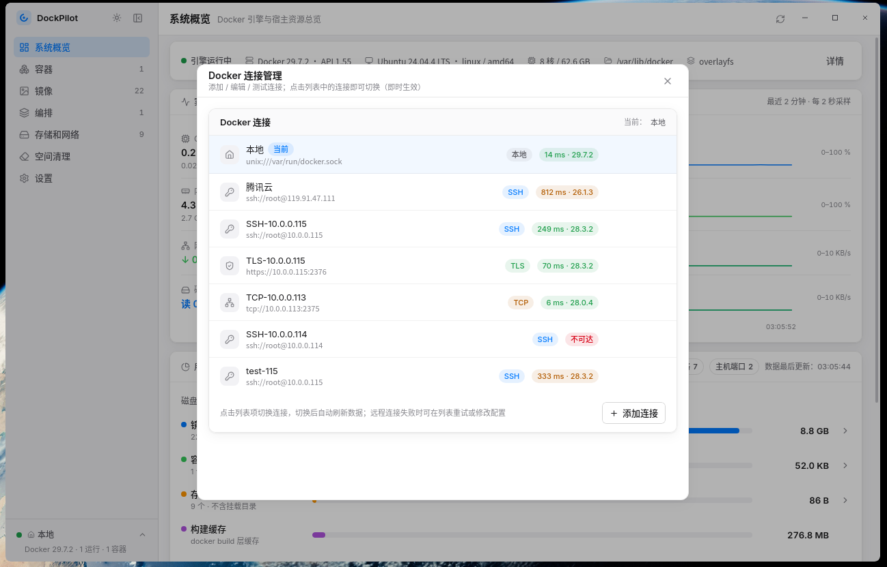

# DockPilot

**Docker 桌面管理器** — 容器 · 镜像 · 编排 · 存储网络 · 远程连接，一个安装包全带走

本地 Socket · SSH 隧道 · TLS · 明文 TCP · Linux · Windows

[](LICENSE)
[](https://github.com/WuYiLingOps/dockpilot/releases)
[](https://tauri.app)
[](https://rustup.rs)
[](https://react.dev)

**开源地址**：[GitHub](https://github.com/WuYiLingOps/dockpilot) · [Gitee](https://gitee.com/WuYiLingOps/dockpilot)

市面上的 Docker 管理工具（Portainer、Dockge 等）几乎都是 Web 端：要先部署一个容器服务，再用浏览器访问——管理 Docker 反而先给 Docker 添了个负担。

DockPilot 把这套能力装进桌面应用：Tauri 2 单窗口 + Rust 内核直连 Docker Engine API，管理本机或远程 Docker 无需部署任何服务。下载一个安装包就能用：不部署、不占端口、不登录。连接凭据与仓库密码都存在本机——SSH 支持密码（存系统钥匙串/加密文件）或私钥，仓库密码进系统钥匙串。

[项目预览](#项目预览) · [它能做什么](#它能做什么) · [怎么工作](#怎么工作) · [技术栈](#技术栈) · [快速开始](#快速开始) · [构建与安装](#构建与安装) · [项目结构](#项目结构)

**使用手册**（docs/）：[远程连接](docs/remote-connection.md) · [镜像推送](docs/push-images.md) · [云同步](docs/cloud-sync.md) · [常见问题](docs/faq.md)

**参与贡献与版本记录**：[CONTRIBUTING.md](docs/CONTRIBUTING.md) · [CHANGELOG.md](CHANGELOG.md)

---

## 项目预览

**系统概览**


**容器**


**容器详情**


**镜像**


**编排**


**存储和网络**


**空间清理**


**设置**


**连接管理**



OrbStack 式布局：侧栏导航（顶部按钮可收起为图标栏，状态本地记忆）+ 点击进入详情，日志、终端、监控收敛为详情页内的 Tab；亮 / 暗双主题（跟随系统）与自定义一体化标题栏。窗口四角为 8px Fluent 圆角：Linux 走透明窗口 + CSS 裁剪，Windows 11 走系统原生 DWM 圆角（自带抗锯齿与阴影，Windows 10 无原生圆角 API 显示直角），最大化或全屏时自动恢复直角。

## 它能做什么

- **容器** — 列表 / 搜索 / 启动 / 停止 / 重启 / 暂停 / 恢复 / 删除，Docker 事件驱动实时刷新；healthcheck 徽标（健康 / 不健康 / 检查中）；compose 容器带项目徽标，点击直达编排详情
- **容器创建** — 镜像选择（本地不存在时自动拉取并显示进度）、容器名（可留空自动生成）、端口映射（多行、tcp/udp）、卷挂载（多行、只读）、环境变量、标签、资源限制（内存 MB/GB、CPU 核数可小数）、命令覆盖（按 shell 词法解析）、工作目录、网络选择、主机名、重启策略、自动移除 / 特权模式 / TTY / 标准输入，与 Docker Desktop 的 Run 能力对齐；支持粘贴 `docker run` 命令自动解析回填（-p/-v/-e/-l/--name/--restart/--memory/--cpus 等常用选项），以及克隆现有容器（inspect 反解析为表单，compose 标签自动剔除；原容器运行中时自动改为不重启策略并提示端口 / 卷可能冲突，避免克隆体因启动失败陷入无限重启循环）
- **容器详情** — 概览（CPU / 内存 / 网络 / 磁盘 I/O 实时曲线，CPU / 内存限额与占比展示，healthcheck 状态与最近一次失败输出；未运行时展示退出码 / OOM 等退出原因与排查提示，启动即失败会在操作提示中直接告知）、日志（流式、自动跟随、关键字过滤、时间戳、stderr 高亮、按当前参数导出文件）、终端（交互式 bash / sh / ash，自适应窗口尺寸）、进程（docker top 实时进程表）、文件（浏览 / 上传 / 下载 / 删除，等同 docker cp；目录列表与删除需容器运行中）、原始 Inspect JSON 查看器（关键字过滤、一键复制）；支持在线更新配置（docker update 调整重启策略与内存 / CPU 限制，无需重建容器）
- **镜像** — 列表 / 搜索 / 来源筛选（按镜像地址前缀归组）/ 删除（可强制）/ 拉取（实时进度，缺省标签自动补 latest，按镜像来源自动匹配仓库凭据）；tar 归档导出（批量、共享层去重、可取消）与导入（多镜像）、标签管理与逐个移除；推送到私有仓库，支持多选批量推送（逐行自动推导目标引用、顺序推送、单镜像失败不阻塞，见「[镜像推送](docs/push-images.md)」）
- **编排（docker compose）** — 基于容器标准标签自动识别 compose 项目并聚合服务；未运行的项目也可管理：运行过的项目自动记忆保留（`down` 后仍可一键重启），支持手动注册 compose 文件（SSH 连接填写远端路径）与扫描目录自动发现，来源徽标区分；项目级启动 / 停止 / 重启 / 暂停 / 下线（可选删卷删镜像）/ 构建 / 拉取，服务级启停与重启，输出流式展示可中途取消；compose 文件在线编辑（语法预检、自动备份、重新应用）。调用系统 compose CLI（自动探测插件版与独立版，未安装时仍可查看并提示）
- **存储和网络** — 存储卷（列表 / 详情含挂载点与使用容器 / 创建 / 删除，占用与引用计数来自 `docker system df`）、网络（详情含 IPAM 与已连接容器 / 创建 / 删除 / 连接断开容器，内置网络禁止删除）、磁盘用量（占比树图、构建缓存明细、直达空间清理），卷 / 网络数据事件驱动自动刷新
- **系统概览** — Docker 引擎与宿主资源总览：基础信息、容器 CPU / 内存占用、网络与磁盘实时曲线、用量统计树图；「存储卷 / 网络」统计卡片可点击直达对应子页签
- **空间清理** — 悬空镜像 / 未使用镜像 / 已停止容器 / 未使用卷 / 构建缓存的大小与数量统计，勾选一键清理并显示回收空间
- **多连接管理** — 多个 Docker 连接的配置、连通性测试（延迟与版本）、添加 / 编辑 / 删除、一键切换即时生效；侧栏底部快速切换。SSH 由应用内置引擎自动建立加密隧道（密码或私钥、rootless socket），见「[远程连接](docs/remote-connection.md)」
- **镜像仓库凭据** — 阿里云 ACR / Harbor 等 Docker Registry v2 兼容仓库的凭据管理与连通性测试（通用仓库可填 `docker.io`、`ghcr.io`、`quay.io` 等官方源），密码存入系统钥匙串；推送镜像用，拉取时按镜像来源自动匹配（见「[镜像推送](docs/push-images.md)」）
- **SSH 凭证钥匙串** — 两类可复用凭证：**钥匙串私钥**（文件导入或粘贴 PEM，自动推导公钥指纹与公钥，多连接引用，连接时内存解析不依赖本机路径）与**身份**（用户名 + 密码 + 可选关联私钥）；均随云同步跨设备（默认可关），见「[远程连接](docs/remote-connection.md)」
- **多设备云同步** — 连接配置、SSH 钥匙串与凭证（默认同步可关）、镜像仓库条目与显示设置端到端加密后同步到 GitHub 私有 Gist，多台设备自动合并；云端只存密文（凭证明文在同步密码的加密信封内），同步密码解锁后记住在本机密钥库、启动自动解锁（可随时锁定清除），见「[云同步](docs/cloud-sync.md)」
- **后台常驻** — 系统托盘常驻，首次关闭窗口弹窗询问「最小化到托盘 / 退出应用」（可勾选记住选择，设置 → 应用 → 关闭窗口时 可随时修改）；最小化后容器异常桌面通知持续生效，单实例运行、二次启动自动唤起已有窗口
- **设置** — 主题、连接管理、镜像仓库凭据、多设备云同步、列表刷新间隔、日志与终端默认值、容器异常桌面通知、关闭窗口行为（每次询问 / 最小化到托盘 / 完全退出）、故障诊断（使用日志查看、调试日志开关、日志定时清理、导出诊断包），持久化到 `~/.config/com.dockpilot.app/settings.json`
- **镜像加速 / daemon.json 编辑（Linux）** — Docker Desktop 式直接编辑 `/etc/docker/daemon.json` 全文（pkexec 提权写入、覆盖前自动备份），实时校验（JSON 语法 + 语义检查 + dockerd `--validate` 深度校验，旧版 Docker 自动降级）、内置国内预设源快捷开关、一键测速、pkexec 不可用时回退为可复制的终端命令

### 它不是什么

__它不是__容器编排平台——面向单台 Docker daemon（本机或远程），不做 Swarm / Kubernetes 多集群编排；__也不是__镜像构建工具——没有 build 流水线；__更不是__常驻服务——完全退出后不在任何主机上留下后台进程，托盘最小化是用户主动选择的桌面后台运行，托盘菜单一键即可退出。

### 什么时候用它

| 现场 | 传统 Web 方案 | DockPilot |
| :--- | :--- | :--- |
| 管理本机 Docker | 部署 Portainer 容器，浏览器访问 | 安装包即装即用，直连本地 socket |
| 管理远程 Docker | 远程机开 2375 端口，或再部署一套服务 | SSH 隧道加密直连，远端零部署 |
| 离线 / 严苛内网 | 需要服务与浏览器互通 | 桌面应用本地运行，凭据不出本机 |
| 多台设备配置一致 | 配置存服务端，或手动导出导入 | 云同步到自己的 GitHub 私有 Gist，端到端加密自动合并 |

## 怎么工作

```
 React 19 界面 ◄── Tauri IPC / Channel ──► Rust + tokio 后端
                                               │
                         ┌─────────────────────┼─────────────────────┐
                         ▼                     ▼                     ▼
                     bollard              secret_store           daemon_config
                 （Docker Engine API）  （钥匙串 / 加密文件）    （daemon.json 提权）
                         │
        ┌────────────────┼────────────────┐
        ▼                ▼                ▼
    本地 socket       SSH 隧道        TLS / 明文 TCP
   （Linux 本机）  （远端零部署）     （2376 / 2375）
        └────────────────┼────────────────┘
                         ▼
              Docker Engine（本机 / 远程）

      编排（compose）不走 Engine API，而是调用系统 compose CLI 子进程执行：
                                               │
                         ┌─────────────────────┴─────────────────────┐
                         ▼                                           ▼
                  本机 / 直连连接                                SSH 连接
    （子进程注入 DOCKER_HOST 指向当前 Engine）        （经内置 russh 引擎在远端执行，
                                                           本机无需安装 Docker）
```

- **谁负责什么** — 前端只做展示与交互；到 Engine 的连接由 Rust 后端持有，所有 Docker 操作、流式进度、事件监听都跑在 Tokio 任务里
- **连接怎么建** — 设置里的每个连接是一份配置，切换即时重建并自动取消旧连接上的流；SSH 在本地拉起加密隧道（Linux socket 转发 / Windows TCP 转发），隧道随连接切换与应用退出回收，进程意外退出会在下次使用时自动重建
- **命令怎么执行** — Docker 操作走 bollard（Engine API）；compose 编排走系统 CLI（自动探测插件版与独立版）：本机 / 直连时注入 `DOCKER_HOST`，SSH 连接时经 SSH 直接在远程服务器上执行，本机无需安装 Docker
- **数据怎么刷新** — 列表由 Docker 事件推送自动失效刷新；日志、统计、终端等长驻流通过 Tauri Channel 推送并注册统一取消句柄——切页即停流，不留无主任务
- **敏感信息怎么存** — SSH 密码/私钥口令经系统钥匙串加密存储（无钥匙串环境回退机器绑定加密文件），私钥只存路径；仓库密码同样优先写入系统钥匙串；推送 / 拉取时密码经请求头传给 daemon，不写 `~/.docker/config.json`、不落远端盘

## 技术栈

| 层 | 选型 | 说明 |
|---|---|---|
| 桌面框架 | Tauri 2 | 系统原生 WebView（Linux 使用 WebKitGTK，Windows 使用 WebView2），安装包与内存占用远小于 Electron |
| 后端 | Rust + bollard | Docker Engine API 的异步 Rust 客户端；Linux 本地 Unix socket，远程经 TCP / TLS / SSH 隧道 |
| 前端 | React 19 + TypeScript + Tailwind CSS 4 | 构建用 Vite |
| 终端 | @xterm/xterm | 与后端 exec 流通过 Tauri Channel 桥接 |
| 状态 | TanStack Query + Docker events | 列表数据由事件推送自动失效刷新 |

## 快速开始

**前置要求**：[Rust](https://rustup.rs) ≥ 1.90 与 Node.js ≥ 20（开发构建）。Linux 需 Ubuntu 22.04 / 24.04（其他发行版理论可用，未验证）；Windows 10 / 11 仅支持远程连接（SSH / TLS / 明文 TCP）。

```bash
git clone https://github.com/WuYiLingOps/dockpilot.git
cd dockpilot
npm install
npm run tauri dev
```

Linux 需要 WebKitGTK 构建依赖，且当前用户能访问 Docker socket（加入 docker 组后重新登录）：

```bash
sudo apt install libwebkit2gtk-4.1-dev build-essential curl wget file \
  libxdo-dev libssl-dev libayatana-appindicator3-dev librsvg2-dev

sudo usermod -aG docker $USER
```

**只想看界面**：`npm run dev` 打开浏览器预览（http://localhost:1420，主题切换按钮可试亮/暗两套）。`public/tauri-mock.js` 在非 Tauri 环境（无 `__TAURI_INTERNALS__`）下自动生效、为前端提供假数据，真实桌面应用中完全惰性——只改前端时可以不起 Rust。

**测试**：

```bash
cd src-tauri
cargo check          # 类型检查
cargo test           # 单测 + 集成测试（需要本机 Docker daemon 运行）
npm run build        # 前端 tsc + vite 构建
```

依赖本机 daemon 之外的远程链路回归测试默认忽略，运行方式见 [docs/remote-connection.md](docs/remote-connection.md) 的「远程连接集成测试」；Windows CI 仅运行不依赖本地 Docker daemon 的测试。

## 构建与安装

### 方式一：下载安装包（推荐）

从 [Releases](https://github.com/WuYiLingOps/dockpilot/releases) 下载对应平台的安装包：

- **Linux deb**（`DockPilot_<版本>_amd64.deb`）：Ubuntu 22.04 / 24.04 等 Debian 系，`sudo apt install ./DockPilot_*_amd64.deb` 或双击安装
- **Windows NSIS 安装包**（`DockPilot_<版本>_x64-setup.exe`）：安装向导，自动创建开始菜单 / 桌面快捷方式
- **Windows 便携版**（`DockPilot_<版本>_x64_portable.exe`）：单个 exe 免安装，放到任意目录双击即用，删除文件即卸载；与安装版共用同一份配置数据，可无缝互换；需系统已有 WebView2 运行时（Windows 11 自带）

所有 Windows 包当前未配置代码签名，首次运行可能出现 SmartScreen 未知发布者提示（「更多信息 → 仍要运行」）；Windows 版仅支持远程连接（SSH / TLS / TCP）。

### 方式二：本地构建

Linux 使用 `management.sh` 打包 deb；Windows 使用 `management.ps1` 打包 NSIS 安装包（发布版的 Windows 安装包由 GitHub Actions 的 Windows runner 构建）。两个一键脚本均支持版本同步、打包、安装和卸载，PowerShell 版另带 `dev` / `test` / `cargo-test` / `check` / `clippy` 编译测试快捷命令：

```bash
./management.sh build           # 打包 deb（使用项目当前版本）
./management.sh build 0.3.4     # 同步版本号后打包 deb
./management.sh version 0.3.4   # 只同步版本号，不执行构建
./management.sh install         # 安装最新的 deb（脚本自动通过 sudo 提权）
./management.sh uninstall       # 卸载 dock-pilot
```

Windows（PowerShell 5.1+；被执行策略拦截时用 `powershell -ExecutionPolicy Bypass -File .\management.ps1 <命令>`）：

```powershell
.\management.ps1 build           # 打包 NSIS 安装包（使用项目当前版本）
.\management.ps1 build 0.3.4     # 同步版本号后打包 NSIS 安装包
.\management.ps1 version 0.3.4   # 只同步版本号，不执行构建
.\management.ps1 install         # 静默安装最新的 NSIS 安装包（-Yes 跳过覆盖/升级确认）
.\management.ps1 uninstall       # 静默卸载 DockPilot
```

- 两个脚本的 `version <版本号>` 都同步更新 `package.json`、`package-lock.json`、`Cargo.toml`、`Cargo.lock` 与 `tauri.conf.json`；`build <版本号>` 先执行同样的版本同步
- `build` 会自动清理旧产物，并给版本号附加当日日期（如 `0.3.1+20260925`）便于追溯与覆盖安装；构建阶段会覆盖项目本地和用户全局 Cargo 配置注入镜像源，切换时按脚本内注释成对启用对应的 `replace-with` 和 `registry` 参数（Linux 版通过 Cargo 命令行 `--config` 注入；Windows 版因 tauri CLI 不经过 `.cmd` 包装脚本，改用 `CARGO_*` 环境变量注入，效果相同）
- Windows 版构建前会检查 Node / Rust / WebView2 Runtime / MSVC C++ 生成工具，并自动从注册表补齐缺失的 PATH 与 `CARGO_HOME` / `RUSTUP_HOME`（Rust、Node 装在自定义目录也能识别）；安装 / 卸载走 NSIS 静默模式（`/S`），需要管理员权限时自动触发 UAC
- 手动方式：Linux `npm run tauri build -- --bundles deb`（与 `management.sh build` 口径一致），deb 产物在 `src-tauri/target/release/bundle/deb/`（deb 包名为 `dock-pilot`），例如 `sudo apt install ./DockPilot_0.3.1_amd64.deb`；Windows `npm run tauri build -- --bundles nsis`（与 `management.ps1 build` 口径一致），产物在 `src-tauri/target/release/bundle/nsis/`
- Windows NSIS 安装器内置快捷方式图标刷新钩子（`src-tauri/windows/installer-hooks.nsh`）：覆盖安装后自动重写已存在的桌面 / 开始菜单快捷方式并通知系统清空图标缓存，避免升级后快捷方式仍显示旧版本图标（Windows 会按 exe 路径缓存图标，且升级安装不会重建快捷方式）

**本地直接运行**（无需安装 deb）：

```bash
npm run tauri build
./src-tauri/target/release/dockpilot
# 调试构建：src-tauri/target/debug/dockpilot（cargo build 产物）
```

**Wayland 任务栏图标**：Wayland 下任务栏图标靠窗口 app-id 与 `.desktop` 文件匹配，dev 模式默认没有桌面入口，任务栏会显示通用图标。把调试二进制注册为用户级应用即可解决：

```bash
mkdir -p ~/.local/share/applications
REPO=$PWD   # 仓库克隆目录，按实际路径调整
cat > ~/.local/share/applications/dockpilot-dev.desktop <<EOF
[Desktop Entry]
Categories=Development;Utility;
Comment=DockPilot 开发模式（调试二进制）
Exec=$REPO/src-tauri/target/debug/dockpilot
StartupWMClass=dockpilot
Icon=$REPO/design/app-icon.png
Name=DockPilot (Dev)
Terminal=false
Type=Application
EOF
update-desktop-database ~/.local/share/applications
```

- `Exec` 与 `Icon` 需按实际仓库路径修改；应用窗口的 app-id 为二进制名 `dockpilot`
- **安装正式 deb 后请删除该文件**（`rm ~/.local/share/applications/dockpilot-dev.desktop`），避免与安装版（`StartupWMClass=dockpilot`）产生匹配歧义

## 远程连接

支持管理多个 Docker 连接并随时切换：Linux 支持**本地 socket / SSH / TLS / 明文 TCP**，Windows 支持 **SSH / TLS / 明文 TCP**；SSH 由应用内置引擎自动建立加密隧道（密码或私钥、rootless socket），远端零部署。配置步骤、TLS 证书生成实操与故障排查详见 **[docs/remote-connection.md](docs/remote-connection.md)**。

## 镜像推送

把本地镜像推送到 Docker Registry v2 兼容仓库，优先适配阿里云 ACR 与自建 Harbor；凭据存系统钥匙串，支持多选批量推送与推送报错对照。使用方法与安全说明详见 **[docs/push-images.md](docs/push-images.md)**。

## 云同步

多台设备间的配置同步：连接配置、镜像仓库条目与显示类设置端到端加密后存到你自己的 GitHub 私有 Gist，云端只有密文。使用方法、同步范围与安全护栏详见 **[docs/cloud-sync.md](docs/cloud-sync.md)**。

## 常见问题与已知说明

崩溃排查与日志位置、Linux 黑屏、托盘图标、Alpine 终端、文件页签限制、Windows 本机 Docker、daemon.json 权限、仓库密码存储与同步密码找回等常见问题，见 **[docs/faq.md](docs/faq.md)**。

## 项目结构

```
design/
├── app-icon.svg              # 图标矢量源文件（舵轮 + 集装箱）
├── app-icon.png              # 1024px 渲染源图
└── icon-design-philosophy.md # 图标设计哲学
screenshots/                  # README 展示截图
src-tauri/
├── icons/                    # 由 `npx tauri icon design/app-icon.png` 生成
├── windows/
│   └── installer-hooks.nsh   # NSIS 安装钩子：覆盖安装后刷新快捷方式与系统图标缓存
└── src/
    ├── lib.rs                # 应用入口：单实例、系统托盘与关闭窗口拦截、状态注册、全局事件监听、命令注册
    ├── main.rs
    ├── settings.rs           # 应用设置读写（含连接配置与镜像仓库凭据模型、旧配置迁移与清洗）
    ├── secret_store.rs       # 凭据密钥存储：系统钥匙串优先，回退机器绑定 AES-256-GCM 加密文件
    ├── registries.rs         # 镜像仓库凭据 CRUD 与连通性测试（/v2/ 探测 + Bearer/Basic 分派）
    ├── github_sync.rs        # 云同步 Rust 桥：GitHub Device Flow、Gist raw 兜底下载、token 钥匙串存取
    ├── daemon_config.rs      # 镜像加速：daemon.json 整文件读写 / 校验 / pkexec 提权 / 测速
    ├── cleanup.rs            # 空间清理：磁盘占用统计与各类 prune
    └── docker/
        ├── conn.rs           # 多连接管理与运行时切换、连接缓存、四种传输分发
        ├── ssh_client.rs     # 内置 SSH 引擎（russh）：密码/密钥认证、隧道转发、远程执行
        ├── ssh_known_hosts.rs # SSH 主机指纹 TOFU 存储与确认
        ├── dto.rs            # 发送给前端的序列化结构
        ├── state.rs          # 流取消句柄注册表 + 终端会话表
        ├── system.rs         # docker_info / host_stats / system_df（含构建缓存明细）
        ├── containers.rs     # 容器列表 / 生命周期操作 / 创建并启动（Docker Desktop Run 对齐）
        ├── networks.rs       # 网络列表（含连接明细与 IPAM）/ 创建 / 删除 / 连接断开容器
        ├── volumes.rs        # 卷列表（合并 df 占用与容器挂载）/ 创建 / 删除
        ├── compose.rs        # 编排：标签分组识别项目 + 本地跟踪（未运行项目记忆/手动注册/目录扫描）+ 调用 compose CLI（本机注入 DOCKER_HOST / SSH 远程执行，流式输出）
        ├── images.rs         # 镜像列表 / 删除 / 拉取（按来源自动匹配仓库凭据）/ 导出导入（save & load 流式）/ 标签管理
        ├── push.rs           # 镜像推送（凭据经 X-Registry-Auth 头传给 daemon，自动打标签、流式进度）
        ├── logs.rs           # 日志流
        ├── stats.rs          # 资源统计流（CPU/内存/网络/块 I/O 换算，CPU 限额折算）
        ├── exec.rs           # 交互式终端（exec + stdin + resize）
        └── events.rs         # Docker 事件全局监听与订阅转发（切换连接时重建）
src/
├── components/               # Sidebar（含连接切换器）、TitleBar、通用 UI 组件、compose/ 输出面板、containers/ 创建容器弹窗、detail/ 详情页视图
├── components/overview/      # 系统概览的纯 SVG 图表（环形 / 折线 / 树图）
├── components/settings/      # 连接管理、镜像仓库凭据管理、云同步与镜像加速设置分组
├── pages/                    # 系统概览 / 容器 / 镜像 / 容器详情 / 编排 / 编排详情 / 存储和网络 / 空间清理 / 设置
├── hooks/                    # 容器操作 mutation、compose 输出流、云同步自动化（启动检查 / 去抖触发）
├── lib/api.ts                # Tauri invoke 封装（流式命令返回取消函数）
├── lib/sync/                 # 云同步：加密（AES-256-GCM + PBKDF2）、三方合并、Gist 适配、同步引擎（锚点 / 护栏）
├── lib/settings.ts           # 设置 query/mutation、连接切换 mutation 与主题迁移
├── lib/registries.ts         # 镜像仓库凭据 query/mutation hooks
├── lib/theme.ts              # 主题三态 store（跟随系统 / 浅 / 深）
├── lib/format.ts             # 字节 / 时间 / 端口格式化
└── types/                    # 与 Rust DTO 一一对应的 TS 类型
```

## 版本与发布

版本号统一维护在 `package.json`、`Cargo.toml` 与 `tauri.conf.json`，`./management.sh version <x.y.z>`（Linux）/ `./management.ps1 version <x.y.z>`（Windows）一键同步；Release 附件含 Linux deb 与 Windows NSIS 安装包 / 便携版 exe 三种格式，历次版本的变更与安装包见 [Releases](https://github.com/WuYiLingOps/dockpilot/releases) 页。

## 致谢

| 项目 | 用于 |
|---|---|
| [Tauri](https://tauri.app) | 桌面框架与 IPC |
| [bollard](https://github.com/fussybeaver/bollard) | Docker Engine API 异步客户端 |
| [TanStack Query](https://tanstack.com/query) | 服务端状态与缓存失效 |
| [Tailwind CSS](https://tailwindcss.com) | 界面样式 |
| [xterm.js](https://xtermjs.org) | 交互式终端 |
| [lucide](https://lucide.dev) · [sonner](https://sonner.emilkowal.ski) | 图标与通知 |

## 许可证

[MIT](LICENSE)

## 反馈

遇到问题或有新想法，欢迎提 [GitHub Issue](https://github.com/WuYiLingOps/dockpilot/issues) 或 [Gitee Issue](https://gitee.com/WuYiLingOps/dockpilot/issues)；如果 DockPilot 帮到了你，欢迎点个 ⭐ Star 支持开发。
